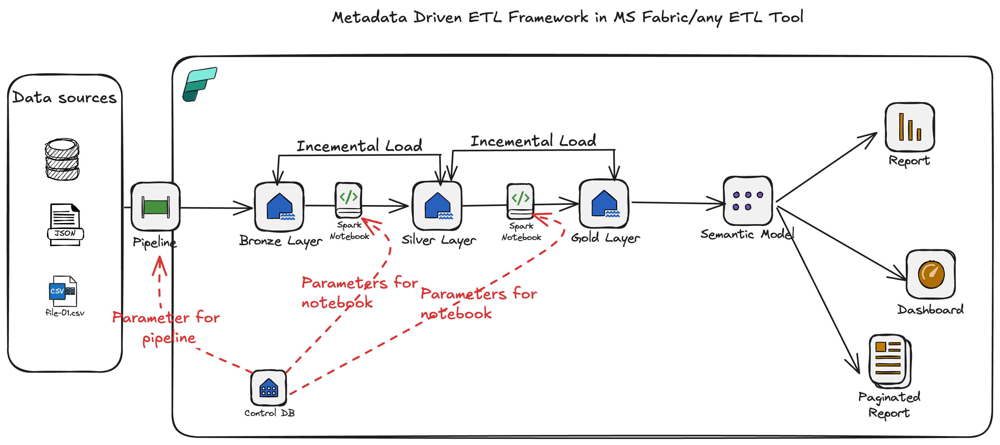
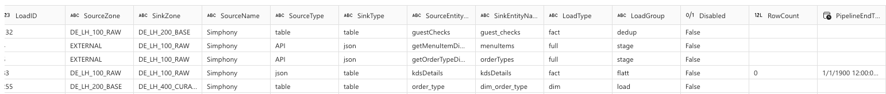
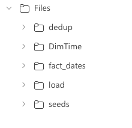

# EtlFramework
Metadata Driven ETL framework

Control DB : 
We have an ETLLoad table in DWH which looks like : 

This table is responsible to control full end to end ETL.

Column definition : 

1. SourceZone : Data source name from where the pipeline needs to pick data. for example SQL DB name, Lakehouse name, Internal, External etc

2. SinkZone : Destination, where we need to land the data (Bronze, silver, gold)

3. SourceType : Table, API, JSON, CSV etc. Based on this column we can dynamically change the logic in pipeline & spark notebooks

4. SinkType : Destination, Format in which you want to save the data

5. SourceEntity : Value of data source, for example for API : It will endpoint, for Lakehouse : It will be delta table name

6. SinkEntityName : Value of destination

7. LoadType : Is it incremental, full load, Fact table, Dimension table, Intermediate etc

8. LoadGroup : Transformation group. for example: stage, dedup, flatt (flatten Json file)

LoadType will contain the folder name where we have txt files with transformation logic (business logic) 

- dedup logic
- seeds
- load 

